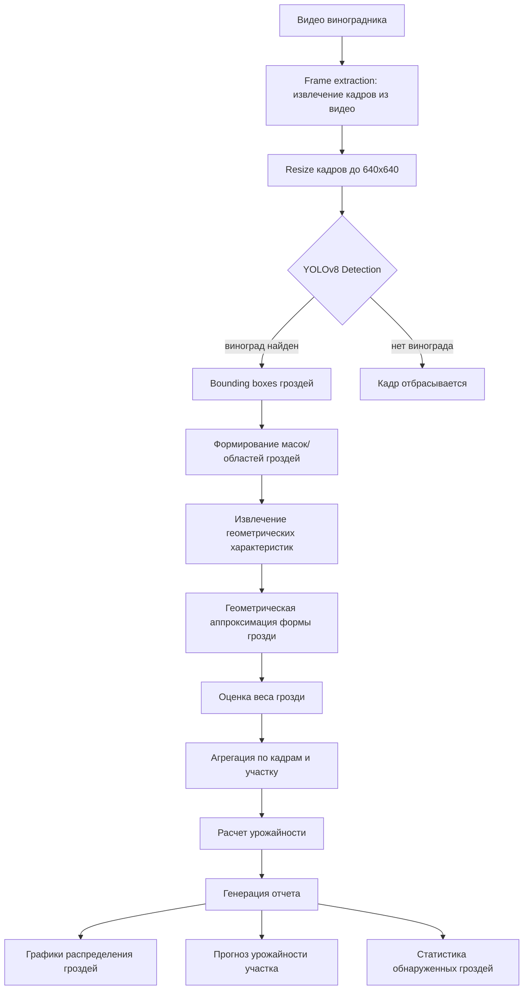

# ML System Design Doc - [RU]
## Дизайн ML системы - \<Fruitinspect - система прогнозирования урожая виноградников\> \<MVP\> \<1\>

### 1. Цели и предпосылки 
#### 1.1. Зачем идем в разработку продукта?  
Бизнес-цель 

Основная цель разработки продукта — снизить финансовые потери винодельческих хозяйств, возникающие из-за неточного прогнозирования урожайности винограда.

> ## Фин эффект пример для винодельни 150Га 

> - Если прогноз 700т урожая а по факту 600т (ошибка 15%):
> -  1. Переплата рабочим (40-60% экономии):
   50 сборщиков × 60000 руб = 3 млн → переплата 450000 руб
   С FruitInspect подписка: 200000 руб → ЭКОНОМИЯ 250000 руб (45%)
> - 2. Избыточная тара (50% экономии):
   35000 ящиков × 50р = 1.75 млн → переплата 350000 руб  
   С FruitInspect: 150000 руб → ЭКОНОМИЯ 200000 руб (55%)
> - 3. Простой переработки (30-50%):
   Фиксировано 10 млн → недозагрузка 1.5 млн руб
   С FruitInspect: 700000 руб → ЭКОНОМИЯ 800000 руб (45%)
> - 4. Лишние закупки сырья (-50%):
   200т × 60000/т = 12 млн → перезакупка 2.4 млн руб  
   С FruitInspect: 1.2 млн руб → ЭКОНОМИЯ 1.2 млн руб (50%)
> - ИТОГО ЭКОНОМИЯ: 2.45 млн руб/сезон (52%)

На текущий момент оценка урожайности выполняется вручную агрономами и основывается на выборочных осмотрах виноградников. Такой подход:

	-	занимает много времени,
	-	зависит от субъективной оценки специалиста,
	-	часто дает значительную погрешность.
Из-за неточных прогнозов компании сталкиваются со следующими проблемами:

	-	избыточный найм сезонных рабочих,
	-	закупка лишней тары для сбора урожая,
	-	недозагрузка или перегрузка производственных мощностей,
	-	неэффективные закупки дополнительного сырья.

Почему станет лучше, чем сейчас

Использование автоматизированного анализа видеосъемки позволяет получать более точную и объективную оценку урожайности, чем ручные методы.
Основные улучшения для бизнеса:
1. Повышение точности планирования
   
   более точная оценка урожая позволяет заранее корректно планировать ресурсы и снижать избыточные расходы.
2. Быстрое получение результата
   
   анализ одного участка виноградника занимает несколько минут, тогда как ручная оценка может занимать несколько дней.
3. Снижение зависимости от человеческого фактора
   
   результаты оценки становятся более стабильными и не зависят от опыта конкретного специалиста.
4. Масштабируемость
   
   система позволяет анализировать большие площади виноградников без пропорционального увеличения затрат на персонал.

Что будем считать успехом итерации с точки зрения бизнеса 

1. Снижение ошибки прогнозирования урожайности
2. Экономический эффект для клиента
3.  Удобство использования
4.  Подтверждение интереса рынка

#### 1.2. Бизнес-требования и ограничения
Краткое описание БТ и ссылки на детальные документы с бизнес-требованиями 

Основная цель проекта — создать цифровой сервис, который позволяет винодельческим хозяйствам быстро и точно оценивать ожидаемый объем урожая винограда на основе видеосъемки виноградников.

Система должна позволять клиенту:

	1.	Загружать видео виноградников, снятое с наземной техники.
	2.	Получать автоматический анализ видеоматериала.
	3.	Получать прогноз урожайности для участка виноградника.
	4.	Использовать результаты прогноза для планирования: количества рабочих на сбор урожая, объема необходимой тары, загрузки перерабатывающих мощностей, закупки дополнительного сырья.

Результат анализа должен предоставляться в виде простого отчета, содержащего:

	-	оценку урожайности на гектар,
	-	общую оценку урожая участка,
	-	визуальную карту распределения урожая по полю.
Бизнес-ограничения

Ограничения данных

	-	доступность размеченных данных ограничена,
	-	видеосъемка может выполняться в разных условиях освещения,
	-	различия между сортами винограда могут влиять на внешний вид гроздей.
 
Технологические ограничения

	-	анализ видео должен выполняться достаточно быстро, чтобы быть полезным в операционном планировании,
	-	система должна работать с распространенными форматами видео.
 
Бизнес-ограничения

	-	стоимость использования сервиса должна оставаться экономически выгодной для винодельни,
	-	решение должно быть масштабируемым и применимым для хозяйств различного размера.
 
Что мы ожидаем от конкретной итерации 

Цель текущей итерации — разработать минимально жизнеспособную версию продукта (MVP), которая позволит проверить ценность решения на реальных данных клиентов.
В рамках итерации планируется:

	-	разработать систему анализа видео виноградников (детекция винограда с кадров полученного видеоматериала),
	-	реализовать базовый алгоритм оценки урожайности,
	-	протестировать систему на ограниченном количестве реальных виноградников,
	-	подготовить отчеты с результатами анализа.
 
Что считаем успешным пилотом? Критерии успеха и возможные пути развития проекта 

Пилот считается успешным при выполнении следующих условий:
1. Подтверждение точности прогнозирования
   
Прогноз урожайности должен быть значительно точнее текущих ручных оценок, используемых агрономами
2. Подтверждение экономического эффекта

Использование системы должно позволить клиенту сократить потери, связанные с ошибками планирования урожая.
3. Положительная обратная связь пользователей

Пользователи должны подтверждать, что результаты анализа полезны для планирования производства.
4. Готовность клиента продолжить использование сервиса

По итогам пилота клиент должен быть заинтересован в дальнейшем использовании продукта.

#### 1.3. Что входит в скоуп проекта/итерации, что не входит

На закрытие каких БТ подписываемся в данной итерации

	-	анализ видеосъемки виноградников,
	-	автоматическое обнаружение гроздей винограда на видео,
	-	оценку количества гроздей,
	-	расчет приблизительного объема урожая,
	-	формирование отчета для пользователя
 
Что не будет закрыто Data Scientist

	-	прогнозирование качества винограда,
	-	прогнозирование сахаристости ягод,
	-	рекомендации по агротехнологиям,
	-	оптимизация процессов производства вина,
	-	интеграция с внутренними информационными системами винодельни.
 
Описание планируемого технического долга 

	-	использование ограниченного объема обучающих данных,
	-	упрощенная архитектура обработки видео,
	-	отсутствие полной автоматизации инфраструктуры обработки данных,
	-	ограниченные возможности масштабирования системы.
 
#### 1.4. Предпосылки решения
1.	Существует связь между визуальными характеристиками виноградника и объемом урожая.
Количество и размер гроздей, наблюдаемых на видео, позволяет оценить общий объем урожая.
2.	Видео виноградника содержит достаточно информации для анализа.
Съемка с дронов или наземной техники позволяет зафиксировать значительную часть гроздей на лозах.
3.	Выборка видеоматериалов является репрезентативной.
Видео охватывает различные участки виноградника и отражает реальное распределение урожая.
4.	Точность автоматического анализа может быть достаточной для задач планирования.
Даже приблизительная оценка урожая может значительно улучшить планирование ресурсов по сравнению с ручными методами.

# 2. Data Science часть

## 2.1 Постановка задачи

С технической точки зрения задача заключается в **прогнозировании урожайности виноградников на основе анализа видеоданных**.

## 2.2 Блок-схема решения

  
## 2.3 Этапы решения задачи

# Этап 1 — Подготовка и предобработка данных

На первом этапе выполняется подготовка данных для обучения и тестирования моделей детекции виноградных гроздей.

В рамках проекта рассматриваются два уровня реализации:

- **Baseline** — работа с существующими датасетами изображений
- **MVP** — система обработки видеоданных виноградников

# Baseline

На этапе baseline используются **существующие датасеты изображений виноградных гроздей**.

Данные представляют собой:

- фотографии виноградных гроздей
- разметку объектов (bounding boxes)
- сегментационные маски гроздей (в некоторых датасетах)

Bounding boxes используются для задачи детекции объектов, а сегментационные маски позволяют более точно определить форму и площадь грозди, что важно для последующей оценки массы.

Все изображения приведены к единому формату:

- размер изображений **640×640**
- RGB формат

Размер **640×640** выбран, поскольку он является стандартным входным разрешением для моделей семейства YOLO и обеспечивает баланс между точностью детекции и скоростью обработки.

### Таблица источников данных

| Название данных | Есть ли данные в компании (если да, название источника/витрин) | Требуемый ресурс для получения данных (какие роли нужны) | Проверено ли качество данных |
|---|---|---|---|
| Dataset изображений виноградных гроздей | Нет (используются открытые датасеты) | Data Scientist | Частично |
| Разметка bounding boxes | Да (в составе датасета) | Data Scientist | Да |
| Сегментационные маски гроздей | Да (в некоторых датасетах) | Data Scientist | Частично |

### Предобработка данных

Перед обучением модели выполняются следующие шаги:

1. очистка датасета  
2. удаление поврежденных изображений  
3. приведение изображений к размеру **640×640**  
4. проверка корректности разметки  
5. преобразование аннотаций в формат YOLO  

### Разделение данных

Данные разделяются на три выборки:

- **Train — 70%**
- **Validation — 15%**
- **Test — 15%**

### Результат этапа Baseline

- подготовленный датасет изображений
- корректная разметка объектов
- сформированные train/validation/test выборки

# MVP

На этапе MVP предполагается использование **видеоданных виноградников**.

Источниками данных могут выступать:

- видеосъемка с наземной техники (трактор / ровер)

Видео позволяет получить значительно больше данных по сравнению с одиночными изображениями и обеспечивает покрытие всего виноградного участка.

### Таблица источников данных

| Название данных | Есть ли данные в компании (если да, название источника/витрин) | Требуемый ресурс для получения данных (какие роли нужны) | Проверено ли качество данных |
|---|---|---|---|
| Видео виноградников | Нет (планируется сбор данных) | Data Engineer / Data Scientist | Нет |
| Кадры видео | Нет | Data Engineer | Нет |
| Разметка гроздей | Нет | Data Annotator | Нет |

### Подготовка видеоданных

Обработка видеоданных включает следующие этапы:

1. извлечение кадров из видео  
2. фильтрацию кадров (удаление нерелевантных кадров)  
3. приведение кадров к размеру **640×640**  
4. разметку гроздей винограда  

Для извлечения кадров из видео может использоваться инструмент **FFmpeg**.

### Формирование датасета

После извлечения кадров выполняется:

- разметка **bounding boxes**
- разметка **сегментационных масок гроздей**
- проверка качества разметки
- формирование обучающей выборки

Использование сегментационных масок позволяет более точно оценивать площадь и форму грозди, что необходимо для последующей геометрической аппроксимации и оценки массы.

### Результат этапа MVP

- набор размеченных кадров виноградников
- датасет с bounding boxes и сегментационными масками
- подготовленный набор данных для обучения моделей детекции и сегментации
- расширение обучающей выборки за счет видеоданных

# Этап 2 — Детекция гроздей винограда

На данном этапе выполняется обнаружение гроздей винограда на изображениях.

Цель этапа — определить положение каждой грозди на изображении и выделить область объекта для дальнейшего анализа геометрических характеристик.

В рамках проекта рассматриваются два уровня реализации:

- **Baseline** — использование существующих аннотаций датасета
- **MVP** — автоматическая детекция и сегментация гроздей на видеоданных

# Baseline

В baseline решении этап детекции в значительной степени упрощен,
поскольку используемые датасеты уже содержат готовую разметку.

Датасет включает:
-  **bounding boxes**
- **сегментационные маски** гроздей

Таким образом, положение и форма объектов уже известны.
В рамках baseline выполняются следующие действия:
1. проверка корректности изображений
2. проверка корректности аннотаций
3. приведение данных к единому формату
4. использование существующих аннотаций для дальнейших расчетов

Модель детекции в baseline не обучается, так как задача обнаружения объектов уже решена в исходном датасете.

Таким образом, этап детекции используется только как источник информации о положении объектов.

### Результат этапа Baseline

На выходе получаем:

- координаты гроздей
- сегментационные маски гроздей

Эти данные используются на следующем этапе для оценки геометрических характеристик и массы гроздей.

# MVP

В MVP решении выполняется полноценная автоматическая детекция гроздей винограда.

Исходными данными являются видеозаписи виноградников.
После извлечения кадров из видео выполняется обнаружение объектов
с использованием моделей компьютерного зрения.

Для решения задачи используется модель **YOLOv8-seg**.

YOLOv8-seg позволяет выполнять:

- **object detection** (bounding boxes)
- **instance segmentation** (маски объектов)

### Входные данные

- изображения виноградников
- размер изображения **640×640**
- RGB формат

### Выход модели

Модель возвращает:

- координаты bounding boxes
- сегментационные маски объектов
- confidence score обнаружения

Сегментационные маски позволяют выделить точную область грозди
на изображении.

### Метрики качества

Для оценки качества детекции используются следующие метрики:

- **mAP@0.5**
- **Precision**
- **Recall**
- **IoU (Intersection over Union)**

### Результат этапа MVP

На выходе получаем:

- координаты гроздей
- сегментационные маски объектов
- вероятность обнаружения объектов

Эти данные используются на следующем этапе для извлечения геометрических характеристик гроздей и оценки их массы.

# Этап 3 — Оценка размера и веса гроздей

На данном этапе выполняется оценка геометрических характеристик
виноградных гроздей и расчет их предполагаемой массы.

Основной задачей этапа является преобразование визуальной информации
(область объекта на изображении) в количественные характеристики:

- площадь грозди
- приблизительный объём
- оценка массы

В рамках проекта рассматриваются два уровня реализации:

- **Baseline** — использование готовых сегментационных масок из датасета  
- **MVP** — использование масок, полученных моделью детекции

# Baseline

В baseline решении используются **сегментационные маски**, которые уже присутствуют в исходном датасете.

Каждая маска представляет собой бинарное изображение, в котором:

- пиксели объекта имеют значение **1**
- пиксели фона имеют значение **0**

### Определение площади грозди

Площадь грозди вычисляется как количество пикселей,
принадлежащих маске объекта.

Формально площадь определяется как:
Area = N_pixels 
N_pixels — количество пикселей, принадлежащих маске объекта
### Геометрическая аппроксимация формы

Форма грозди может быть аппроксимирована простой геометрической фигурой.

Возможные варианты аппроксимации:

- эллипс
- конус
- комбинация нескольких эллипсов

Для упрощения вычислений используется **аппроксимация эллипсом**.

Параметры эллипса определяются на основе:

- высоты грозди
- ширины грозди

Эти параметры извлекаются из bounding box объекта.

### Оценка объёма

При использовании эллиптической аппроксимации
объём грозди может быть приближенно оценён как объём эллипсоида:
V = 4/3 * π * a * b * c
Где a,b,c - полуоси элипсоида 
В практической реализации:

- высота грозди определяется по bounding box
- ширина определяется по маске объекта

### Оценка массы

Масса грозди оценивается через плотность:
Weight = Density * Volume
Density — средняя плотность виноградной грозди
Плотность может быть определена на основе
эмпирических измерений.

### Результат этапа Baseline

На выходе получаем:

- площадь грозди
- приблизительный объём
- оценку массы грозди

---

# MVP

В MVP решении оценка размеров и массы выполняется
на основе **сегментационных масок, полученных моделью YOLOv8-seg**.

Общий алгоритм оценки аналогичен baseline,
однако данные поступают из автоматической системы детекции.

### Основные шаги обработки

1. получение сегментационной маски объекта  
2. выделение области грозди  
3. вычисление площади объекта  
4. извлечение геометрических характеристик  
5. оценка объёма  
6. расчет массы

### Вычисление площади

Площадь объекта определяется по количеству пикселей
в сегментационной маске.

### Геометрические характеристики

Из маски извлекаются:

- высота грозди
- ширина
- форма объекта

Эти параметры используются для аппроксимации формы.

### Оценка объёма и массы

После получения геометрических характеристик
выполняется расчет:

- объёма
- предполагаемой массы грозди

### Результат этапа MVP

На выходе получаем:

- площадь каждой обнаруженной грозди
- геометрические параметры
- оценку массы

Результаты могут использоваться для:

- оценки урожайности
- анализа состояния виноградника
- планирования сбора урожая.

## Альтернативный подход — оценка веса с использованием ML-регрессии

Помимо геометрической аппроксимации формы грозди,
возможен альтернативный подход оценки массы,
основанный на использовании моделей машинного обучения.

В данном подходе масса грозди предсказывается на основе
визуальных характеристик объекта,
извлечённых из сегментационной маски.

### Извлечение признаков

После получения маски объекта выполняется извлечение
геометрических признаков грозди.

Основные признаки могут включать:

- площадь маски (количество пикселей объекта)
- высота грозди
- ширина грозди
- отношение высоты к ширине
- периметр контура
- компактность формы

Компактность может быть вычислена как:
- Compactness = 4π * Area / Perimeter²
Этот показатель характеризует степень
приближения формы объекта к окружности.

### Построение модели регрессии

На основе извлеченных признаков строится модель,
которая предсказывает массу грозди.

Возможные алгоритмы:

- Linear Regression
- Random Forest Regressor
- Gradient Boosting

Модель обучается на выборке,
где для каждой грозди известны:

- изображение
- сегментационная маска
- фактический вес

### Предсказание массы

После обучения модель получает на вход
вектор признаков грозди и возвращает
оценку массы объекта.

Формально задача может быть записана как:
- weight=t(features(features = {area, height, width, perimeter, compactness})

### Результат

На выходе получаем модель,
которая автоматически оценивает
массу грозди винограда
на основе её визуальных характеристик.

# Этап 4 — Агрегация результатов и формирование отчётности

На данном этапе выполняется агрегирование результатов анализа
и формирование отчёта по обнаруженным гроздям винограда.

Цель этапа — преобразовать результаты обработки изображений
в аналитическую информацию, которая может использоваться
для оценки урожайности и анализа состояния виноградника.

Основные задачи этапа:

- агрегирование данных по обнаруженным гроздям
- анализ распределения характеристик гроздей
- визуализация результатов
- формирование итогового отчёта

---

# Агрегация данных

После обработки изображения для каждой обнаруженной грозди
формируется набор характеристик.

Основные параметры грозди:

- координаты объекта
- высота грозди
- верхний радиус
- нижний радиус
- объём грозди
- оценка массы
- confidence детекции

Все параметры сохраняются в структурированном виде
в таблицу данных.

Пример структуры данных:

| Параметр | Описание |
|---|---|
| cluster | номер грозди |
| height_px | высота грозди |
| R_px | верхний радиус |
| r_px | нижний радиус |
| volume_px3 | оценка объёма |
| estimated_weight_g | оценка веса |
| confidence | уверенность детекции |

# Оценка общей урожайности

После обработки всех объектов выполняется
агрегирование веса всех обнаруженных гроздей.

Общая масса определяется как:
- TotalWeight = Σ Weight_i ( оценка массы i грозди )
Полученное значение позволяет оценить
общую массу урожая на анализируемом изображении.

---

# Визуализация результатов

Для анализа характеристик гроздей
строятся различные визуализации данных.

Основные типы графиков:

### Распределение веса гроздей

Гистограмма позволяет определить,
какие размеры гроздей преобладают
на анализируемом участке.

### Связь объёма и веса

Диаграмма рассеяния показывает
зависимость между объёмом грозди
и её массой.

Это позволяет проверить корректность
используемой модели оценки массы.

### Анализ формы гроздей

График зависимости верхнего и нижнего радиусов
позволяет анализировать геометрическую форму
гроздей винограда.

### Связь высоты грозди с весом

Позволяет определить,
насколько высота грозди влияет
на её массу.

### Распределение confidence детекции

Гистограмма уверенности детекции
позволяет оценить качество работы модели.

---

# 3D визуализация гроздей

Для наглядного анализа формы объектов
строится трехмерная визуализация гроздей.

Каждая гроздь представляется в виде
аппроксимированной геометрической фигуры.

Параметры визуализации:

- высота грозди
- верхний радиус
- нижний радиус
- цвет объекта соответствует массе грозди

Такая визуализация позволяет:

- оценить форму гроздей
- сравнить размеры объектов
- визуально проверить корректность оценки веса.

---

# Формирование отчёта

Все результаты обработки сохраняются
в нескольких форматах.

### Табличные данные

Информация по всем обнаруженным гроздям
сохраняется в:

- CSV файл
- JSON файл

Это позволяет использовать данные
для дальнейшего анализа.

### Графические материалы

Построенные графики сохраняются
в виде изображений.

Основные графики:

- распределение веса
- связь объёма и массы
- анализ формы гроздей
- распределение confidence модели

### Итоговый отчёт

Все визуализации и таблицы объединяются
в единый PDF отчёт.

Отчёт содержит:

- исходное изображение с детекцией объектов
- трехмерную визуализацию гроздей
- аналитические графики
- таблицу параметров всех обнаруженных гроздей.

---

# Результат этапа

На выходе системы формируются:

- оценка массы каждой грозди
- общая оценка урожайности
- аналитические графики
- структурированные данные
- итоговый PDF отчёт

Полученные результаты могут использоваться
для анализа состояния виноградника
и оценки урожайности.

### Бизнес-проверка результатов

На этапе пилота результаты прогнозирования сравниваются с:
- данные урожайности предыдущих годов
- фактическим урожаем
- экспертными оценками агрономов.

Это позволяет оценить применимость системы в реальных бизнес-процессах.
